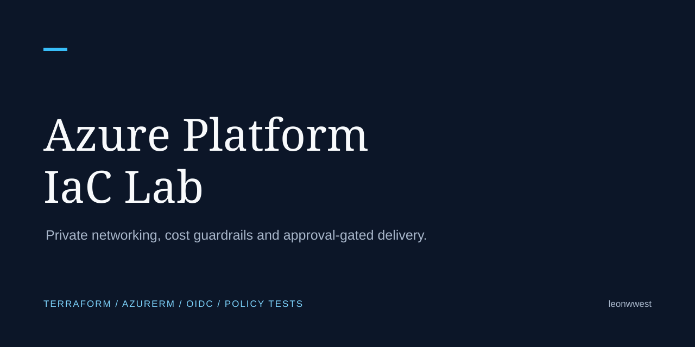
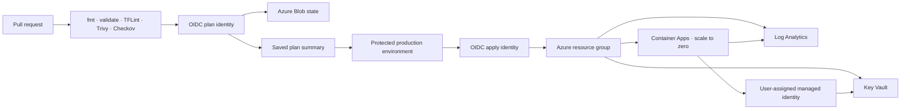
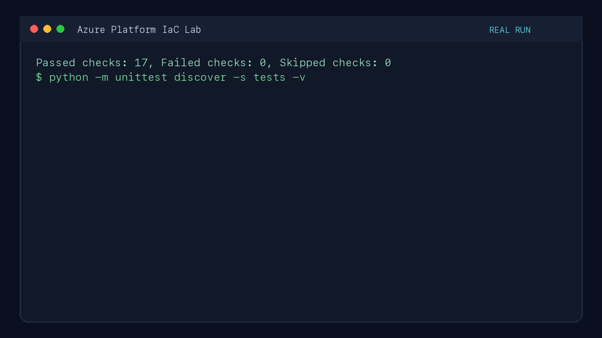

# Azure Platform IaC Lab

[](https://github.com/leonwwest/azure-platform-iac-lab/actions/workflows/verify.yml)
[](https://github.com/leonwwest/azure-platform-iac-lab/actions)
[](LICENSE)



A deployable, portfolio-scale Azure Container Apps platform built with Terraform and the AzureRM v5 provider. It demonstrates secretless GitHub Actions authentication, managed identity, private Key Vault access, observability, cost controls and approval-gated delivery.

## Recruiter quick view

| Question | Evidence |
|---|---|
| What is provisioned? | [Terraform](terraform/) defines a resource group, private-networked Container Apps, managed identity, Key Vault private endpoint and RBAC, Log Analytics, alerting and an optional budget |
| Which provider baseline is used? | [AzureRM v5](terraform/versions.tf), including the v5 private DNS virtual-network-link interface covered by a [contract test](tests/test_portfolio_contract.py) |
| How does CI authenticate? | The [plan](.github/workflows/terraform-plan.yml) and [apply](.github/workflows/terraform-apply.yml) workflows exchange GitHub OIDC tokens with Microsoft Entra; no client secret is stored |
| How is delivery controlled? | Pull requests validate and plan; apply is manual, requires the exact `apply` confirmation and uses a protected GitHub environment |
| How are costs constrained? | Scale-to-zero, one-replica default, small CPU/memory allocation, optional resource-group budget and a documented teardown command |
| What is verified? | [GitHub Actions](.github/workflows/verify.yml) runs Terraform format and validation, TFLint, Trivy, Checkov and repository contract tests |

## Architecture



The plan and apply identities are intentionally separate. The plan identity should receive read-only access; the apply identity receives only the permissions required for the target resource group and state storage.

## Safety model

- No automatic production apply on push.
- No Azure client secrets in GitHub.
- `terraform apply` requires the workflow input `apply` and the `production` environment.
- Container Apps defaults to zero minimum replicas and one maximum replica.
- Key Vault uses Azure RBAC; the workload receives `Key Vault Secrets User`, not broad ownership.
- Key Vault public access is disabled; resolution and traffic use Private DNS and a dedicated private-endpoint subnet.
- Destructive cleanup is explicit and documented.
- The example does not store a demonstration secret in Terraform state.

## Repository map

```text
terraform/                  Azure resources and environment variables
scripts/bootstrap-oidc.sh  Idempotent OIDC bootstrap helper
scripts/demo.sh            Read-only evidence collection after deployment
tests/                     Static portfolio and safety contract tests
.github/workflows/         Verification, OIDC plan and gated apply
docs/                      Architecture decisions, runbook and evidence
```

## Local verification

```bash
cp terraform/terraform.tfvars.example terraform/terraform.tfvars
make verify
```

`make verify` uses locally installed tools when available. The same checks run in GitHub Actions, so a local Azure login is not required for static verification.

## OIDC bootstrap

An Azure administrator performs the one-time trust setup:

```bash
export AZURE_SUBSCRIPTION_ID="00000000-0000-0000-0000-000000000000"
export GITHUB_OWNER="leonwwest"
export GITHUB_REPOSITORY="azure-platform-iac-lab"
./scripts/bootstrap-oidc.sh
```

The helper creates separate plan and apply managed identities plus federated credentials for the GitHub environments. Review every displayed role assignment before accepting it. See [OIDC runbook](docs/oidc-runbook.md).

## Deployment workflow

1. Create the Azure state storage described in the runbook.
2. Add the non-secret repository variables listed in `docs/oidc-runbook.md`.
3. Protect the GitHub `production` environment with a reviewer.
4. Run **Terraform plan (OIDC)** manually.
5. Review the plan summary.
6. Run **Terraform apply (gated)** with the exact confirmation `apply`.
7. Collect read-only evidence with `./scripts/demo.sh`.

## Verification evidence

The green workflow badge links to the latest CI run. The [verification workflow](.github/workflows/verify.yml) executes the same Terraform and security checks documented above on every pull request and push to `main`.

The recording below captures Terraform format and validation plus the repository contract tests running against this codebase.



After a deployment, [`scripts/demo.sh`](scripts/demo.sh) uses read-only Azure CLI queries to generate `docs/evidence/latest.md` with observed values for:

- Container App name and HTTPS endpoint
- configured minimum and maximum replicas
- configured identity type

The [evidence policy](docs/evidence/README.md) keeps generated deployment output separate from static verification and excludes subscription identifiers, tenant identifiers, tokens and secret values.

## Scope and limitations

This repository is scoped to a small application platform, not an enterprise landing-zone module. Regional failover, centralized Azure Policy assignment, a shared network hub and organization-wide identity governance remain explicit extension points for a larger platform design and are tracked in the public roadmap.

## Sources

- [Microsoft: GitHub Actions with Azure OIDC](https://learn.microsoft.com/en-us/azure/developer/github/connect-from-azure-openid-connect)
- [Microsoft: Key Vault references in Azure Container Apps](https://learn.microsoft.com/en-us/azure/container-apps/manage-secrets)
- [HashiCorp: AzureRM provider documentation](https://registry.terraform.io/providers/hashicorp/azurerm/latest/docs)
- [HashiCorp: AzureRM backend with OIDC](https://developer.hashicorp.com/terraform/language/backend/azurerm)

## License

MIT — see [LICENSE](LICENSE).
