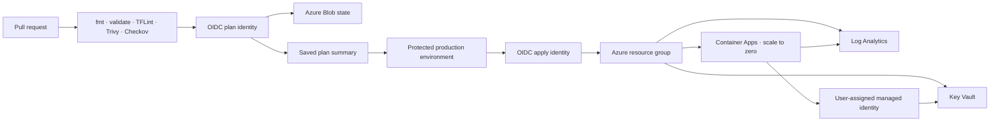

# Azure Platform IaC Lab

[](https://github.com/leonwwest/azure-platform-iac-lab/actions/workflows/verify.yml)
[](https://github.com/leonwwest/azure-platform-iac-lab/actions)
[](LICENSE)


Production-minded Terraform for a small Azure Container Apps platform. The lab demonstrates secretless GitHub Actions authentication, managed identity, Key Vault access, observability, cost controls and approval-gated delivery without pretending that a portfolio subscription is a production tenant.

## Recruiter quick view

| Question | Evidence |
|---|---|
| What is provisioned? | Resource group, private-networked Container Apps, managed identity, Key Vault private endpoint and RBAC, Log Analytics, alerting and optional budget |
| How does CI authenticate? | GitHub OIDC exchanges short-lived tokens with Microsoft Entra; no client secret is stored |
| How is delivery controlled? | Pull requests validate and plan; apply is manual, requires an explicit confirmation input and uses a protected GitHub environment |
| How are costs constrained? | Scale-to-zero, one-replica default, small CPU/memory allocation, optional resource-group budget and complete teardown command |
| What is verified? | Terraform formatting and validation, TFLint, Trivy misconfiguration scan, Checkov policies and repository contract tests |

## Architecture



The plan and apply identities are intentionally separate. The plan identity should receive read-only access; the apply identity receives only the permissions required for the target resource group and state storage.

## Safety model

- No automatic production apply on push.
- No Azure client secrets in GitHub.
- `terraform apply` requires the workflow input `apply` and the `production` environment.
- Container Apps defaults to zero minimum replicas and one maximum replica.
- Key Vault uses Azure RBAC; the workload receives `Key Vault Secrets User`, not broad ownership.
- Key Vault public access is disabled; resolution and traffic use Private DNS and a dedicated private-endpoint subnet.
- Destructive cleanup is explicit and documented.
- The example does not store a demonstration secret in Terraform state.

## Repository map

```text
terraform/                  Azure resources and environment variables
scripts/bootstrap-oidc.sh  Idempotent OIDC bootstrap helper
scripts/demo.sh            Read-only evidence collection after deployment
tests/                     Static portfolio and safety contract tests
.github/workflows/         Verification, OIDC plan and gated apply
docs/                      Architecture decisions, runbook and evidence
```

## Local verification

```bash
cp terraform/terraform.tfvars.example terraform/terraform.tfvars
make verify
```

`make verify` uses locally installed tools when available. The same checks run in GitHub Actions, so a local Azure login is not required for static verification.

## OIDC bootstrap

An Azure administrator performs the one-time trust setup:

```bash
export AZURE_SUBSCRIPTION_ID="00000000-0000-0000-0000-000000000000"
export GITHUB_OWNER="leonwwest"
export GITHUB_REPOSITORY="azure-platform-iac-lab"
./scripts/bootstrap-oidc.sh
```

The helper creates separate plan and apply managed identities plus federated credentials for the GitHub environments. Review every displayed role assignment before accepting it. See [OIDC runbook](docs/oidc-runbook.md).

## Deployment workflow

1. Create the Azure state storage described in the runbook.
2. Add the non-secret repository variables listed in `docs/oidc-runbook.md`.
3. Protect the GitHub `production` environment with a reviewer.
4. Run **Terraform plan (OIDC)** manually.
5. Review the plan summary.
6. Run **Terraform apply (gated)** with the exact confirmation `apply`.
7. Collect read-only evidence with `./scripts/demo.sh`.

## Measurable evidence

The repository publishes verification output as a workflow artifact. After a real deployment, `scripts/demo.sh` records:

- Container App FQDN and revision state
- configured minimum and maximum replicas
- managed identity attachment
- Key Vault RBAC status
- Log Analytics retention
- current resource-group cost when Cost Management data is available

No fabricated production numbers are included. `docs/evidence/latest.md` is created only from Azure CLI output.

### Real verification run

This recording comes from the actual Terraform format/validation commands and repository contract tests. It is a terminal evidence capture, not an AI-generated cloud console.


## Scope and limitations

This is a portfolio lab, not a reusable enterprise landing-zone module. It deliberately omits regional failover, centralized Azure Policy assignment, a shared network hub and organization-wide identity governance. Those belong in a larger platform design and are tracked in the public roadmap.

## Sources

- [Microsoft: GitHub Actions with Azure OIDC](https://learn.microsoft.com/en-us/azure/developer/github/connect-from-azure-openid-connect)
- [Microsoft: Key Vault references in Azure Container Apps](https://learn.microsoft.com/en-us/azure/container-apps/manage-secrets)
- [HashiCorp: AzureRM backend with OIDC](https://developer.hashicorp.com/terraform/language/backend/azurerm)

## License

MIT — see [LICENSE](LICENSE).
